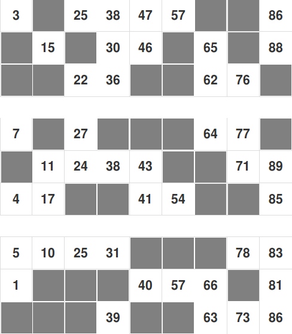

# loto

4-hours project to generate some loto grids for a wedding game.

Constraints:
- 15 numbers between 1 and 89,
- At least one number, and no more than 3 numbers, between each serie of 10 numbers (1 and 9, 10 and 19, 20 and 29, ...)
- Numbers of the same serie are displayed in the same column, but order is random.

Expected result (3 grids example):

